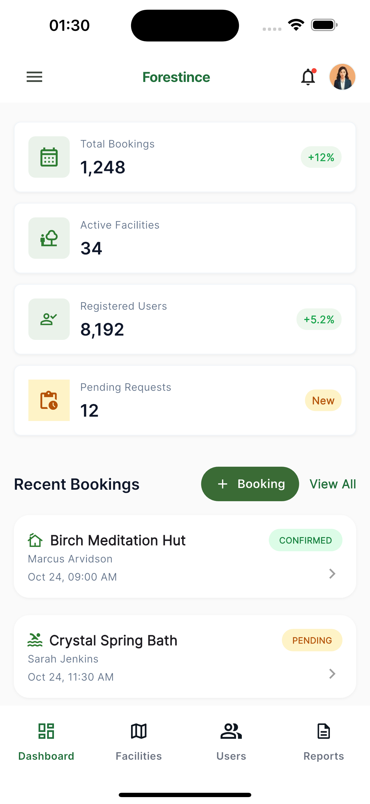
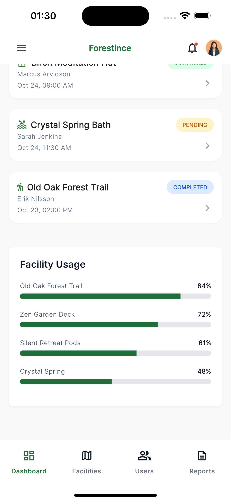
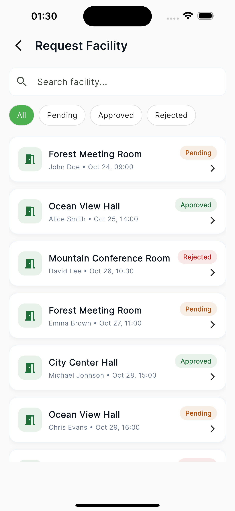

# Forestince — Admin App

> A Flutter admin application for managing facility bookings, built with clean architecture and a
> focus on maintainability.

---

## Table of Contents

- [Overview](#overview)
- [UI Implementation Approach](#ui-implementation-approach)
- [Architecture & Project Structure](#architecture--project-structure)
- [State Management](#state-management)
- [Mock API Strategy](#mock-api-strategy)
- [Localization](#localization)
- [Firebase](#firebase)
- [Technical Trade-offs](#technical-trade-offs)
- [Setup](#setup)
- [Future Improvements](#future-improvements)
- [Demo](#demo)
- [Final Notes](#final-notes)

---

## Overview

Forestince is a prototype Admin Dashboard for managing facilities and booking requests. The project
demonstrates clean architecture decisions, scalable state management, and thoughtful UX handling
while remaining easy to extend and test.

Key goals:

- Clear separation of concerns (Data / Domain / Presentation)
- Reusable UI components and a centralized theme system
- Reactive state handling with Riverpod
- Pixel-consistent UI that matches provided designs

---

## UI Implementation Approach

- Followed the provided design closely (spacing, typography, and color system).
- Broke UI into small, reusable components and widgets.
- Centralized visual styles in `lib/src/shared/theme/app_theme.dart`.
- Ensured consistency across cards, buttons, status badges, and list items.

Design decisions:

- Use Material 3 where appropriate and a consistent color scheme.
- Use themed components (no hardcoded colors in widgets).
- Provide loading / empty / error states for network-like flows.

---

## Architecture & Project Structure

Feature-first layout with clear layering:

- features/
    - dashboard/
        - data/
        - domain/
        - presentation/
    - request_facility/
        - data/
        - domain/
        - presentation/
- shared/
    - theme/
    - widgets/
    - utils/

Layers responsibilities:

- Data: models and mock services (API simulation)
- Domain: controllers/providers (Riverpod) containing business logic
- Presentation: screens, widgets, and UI composition

This separation keeps the UI independent of data implementation and makes swapping in a real backend
straightforward.

---

## State Management

- Riverpod (@riverpod annotation-based) is used throughout for predictable, testable state.
- Examples:
    - `requestFacilityController` — fetches and filters facility requests
    - `requestFacilityFilterController` — holds filter state (status, keyword)

Benefits:

- Clear separation of UI and business logic
- Simple handling of AsyncValue (loading / data / error)
- Easy to unit test controllers and mock services

---

## Mock API Strategy

- Mock services are implemented to simulate API behavior and provide deterministic data for UI
  development:
    - `mock_booking_service`
    - `mock_facility_service`
    - `mock_request_facility_service`

- These services return in-memory lists with slight delays to simulate network latency.
- They make it easy to test search and filter behaviors without a real backend.

---

## Localization

- `AppLocalizations` is used for all user-facing strings.
- The project is ready for multi-language expansion — add ARB files and run the Flutter localization
  build steps.

Note: Current development uses English messages; new messages should be added to
`lib/l10n/app_en.arb` and `flutter pub get` (or `fvm flutter pub get`) then run the localization
generation if needed.

---

## Firebase

- Firebase is configured and initialized in the project (boilerplate present).
- Ready for future integration: Authentication, Firestore, Analytics, etc.

---

## Technical Trade-offs

What was prioritized:

- Clean and maintainable architecture
- Separation of concerns and reusability
- UX states and predictable asynchronous handling

What was intentionally left out (for scope reasons):

- Real backend integration (mock services used instead)
- Comprehensive unit/widget tests (can be added later)

---

## Setup

Flutter: 3.38.7

Clone the repo and run the app locally:

```bash
git clone git@github.com:vnvstore/forestince.git
cd forestince
# Install dependencies (use fvm if your project uses it)
fvm flutter pub get
# Run the app on a connected device or simulator
fvm flutter run
```

If you're not using `fvm`, replace `fvm flutter` with your local `flutter` binary.

---

## Future Improvements

Planned or recommended next steps:

- Integrate a real backend API and authentication flows
- Add unit and widget tests for key controllers and widgets

---

## Demo

Watch the demo video (Google Drive):

-
Watch: [Demo video — Forestince (walkthrough)](https://drive.google.com/file/d/1Ue5Ao13fzJNdY93wOX81OHUq1EyuRTcy/view?usp=drive_link)
-
Download: [Download demo (MP4)](https://drive.google.com/uc?export=download&id=1Ue5Ao13fzJNdY93wOX81OHUq1EyuRTcy)

Screenshots from the app are included below.

<p align="center">
  <a href="assets/screenshots/1.png">
    
  </a>
  <a href="assets/screenshots/2.png">
    
  </a>
  <a href="assets/screenshots/3.png">
    
  </a>
</p>

---

## Final Notes

This project demonstrates:

- Clean architecture thinking
- Scalable Flutter structure
- Practical use of AI in development
- Strong focus on maintainability
